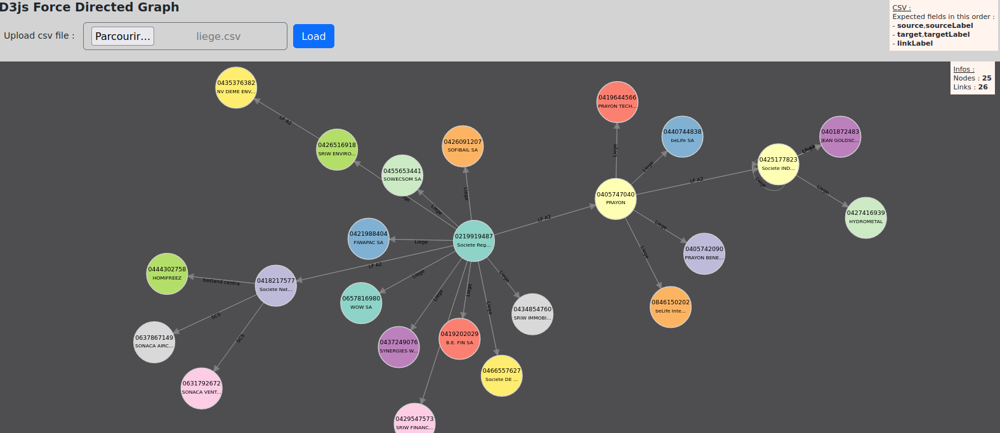

# Jetty-rest-debug
+ embedded jetty 
+ jsp support
+ jersey 
+ multipart support 
+ d3js


## start jetty :  

execute src/main/java/sandbox/App.java  
or with maven :  
`$ mvn clean compile`  
`$ mvn exec:java -Dexec.mainClass="sandbox.App"`  


execute src/main/java/sandbox/App.java  
or with maven :  

`$ mvn clean compile`  
`$ mvn exec:java -Dexec.mainClass="sandbox.App"`  


> http://localhost:8080/rest/application.wadl  
http://localhost:8080/rest/application.wadl?detail=true  
http://localhost:8080/rest/test/hello/WORLD  

> [d3js : upload csv](http://localhost:8080/upload.jsp) &rarr; POST mediaType="multipart/form-data"

  
  
>[generate qr code](http://localhost:8080/qrcode.jsp)

  

8080 Already in use :  
`$ lsof -i:8080`  
`$ kill -9 <PID>`  

---


## Bug fixes

### 1. HTTP ERROR 500 - PWC6033: Unable to compile class for JSP

Cause : mismatch between java and jetty version...  
> Fix :   
- ensure using jdk 8 : eclipse > Window > Preferences > java > Installed JREs  
- use compatible version of jetty in pom.xml : `<jetty.version>9.4.43.v20210629</jetty.version>`  

### 2. InjectionManagerFactory not found. 

`2021-07-20 11:11:04 WARN  ROOT:2353 - unavailable
java.lang.IllegalStateException: InjectionManagerFactory not found.`

> Fix :
```
<jetty.version>9.4.43.v20210629</jetty.version>
[...]
<dependency>
	<groupId>org.glassfish.jersey.inject</groupId>
	<artifactId>jersey-hk2</artifactId>
	<version>${jersey.version}</version>
</dependency>
```

### 3. NO JSP Support

```
2021-07-20 11:15:21 INFO  StandardDescriptorProcessor:277 - NO JSP Support for /, did not find org.eclipse.jetty.jsp.JettyJspServlet
2021-07-20 11:15:21 INFO  StandardDescriptorProcessor:277 - NO JSP Support for /, did not find org.apache.jasper.servlet.JspServlet
```
> Fix :  
```
<jetty.version>9.4.43.v20210629</jetty.version>
[...]
<dependency>
	<groupId>org.eclipse.jetty</groupId>
	<artifactId>apache-jsp</artifactId>
	<version>${jetty.version}</version>
</dependency>
```

### 4. java.lang.NoClassDefFoundError: javax/xml/bind/JAXBEContext

> Fix :  
```
<dependency>
    <groupId>javax.xml.bind</groupId>
    <artifactId>jaxb-api</artifactId>
    <version>2.3.1</version>
</dependency> 
```
